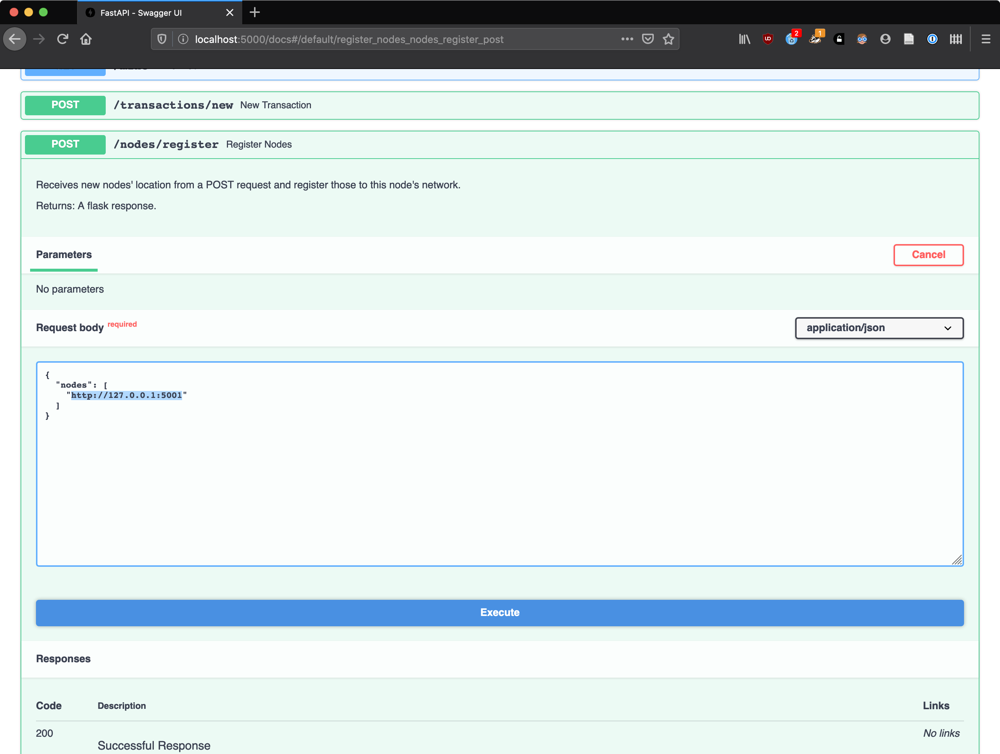
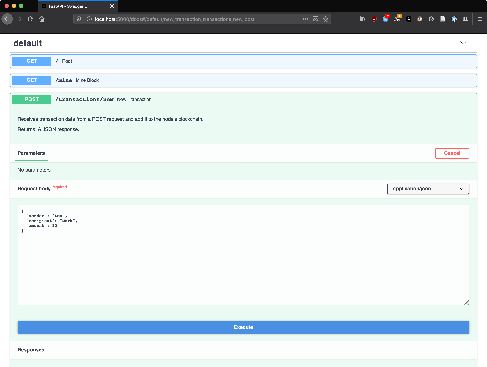
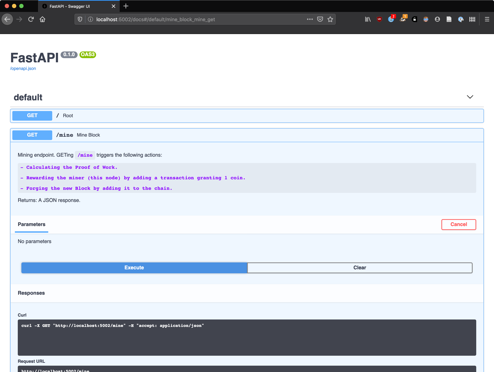

In this section, we'll walk through the process of spinning up a few nodes and playing around with their functionality by adding and querying their chains.

I will be using FastAPI's automatic interactive documentation to perform those operations (see the `Magic documentation` block below), but you can also use your favorite the REST client or simply the command line.
If you decide to go with the latter, you will find included the command to run for each operation.

## Starting Nodes

For convenience, I'll use Docker to spin up two detached nodes:

```bash
docker run --init --rm -dp 5000:5000 toychain
docker run --init --rm -dp 5001:5000 toychain
```

??? note "As a Python command"
    
    If you don't want to use Docker, you can use the toychain Python package. Run:
    
    ```bash
    python -m toychain --port 5000
    python -m toychain --port 5001
    ```
    
    !!! warning "About processes"
        The node needs an ASGI server to run, and we're using [uvicorn]{target=_blank} for this. However, since
        `uvicorn.run()` is a blocking call you'll need to run the above commands in two separated terminal windows or tabs.

We now have two nodes running at respectively `localhost:5000` and `localhost:5001`, and each one has initialized its blockchain at startup.

??? info "Magic documentation"
    
    If you open your browser and head over to the `/docs` (or `/redocs`) endpoint for any one of those two, you should
    see the automatic documentation generated by [FastAPI]{target=-blank}.
    
    Each item expands to reveal details, and even let you interact with the corresponding endpoint if you click the
    `Try it out` option.
    
    

## Registering Nodes

Let's register each node in the other's network so they'll be aware of each other's existence.

To do so, we have to POST to a node's `/nodes/register` endpoint, with the list of node addresses to register.
Let's first register the node at `localhost:5001` to the node at `localhost:5000`:

=== "cURL"
    
    ```bash
    curl --request POST \
      --url http://localhost:5000/nodes/register \
      --header 'content-type: application/json' \
      --data '{
      "nodes": ["http://127.0.0.1:5001"]
    }'
    ```

=== "HTTPie"
    
    ```bash
    echo '{
      "nodes": ["http://127.0.0.1:5001"]
    }' | http POST http://localhost:5000/nodes/register
    ```
    
=== "Wget"

    ```bash
    wget -qSO- \
    --header='Content-Type: application/json' \
    --post-data='{
      "nodes": ["http://127.0.0.1:5001"]
    }' http://localhost:5000/nodes/register
    ```

=== "Through documentation"

    To do so through the documentation, let's expand the `nodes/register` endpoint section at `localhost:5000/docs` and
    click on `Try it out`. There, in the request body, let's replace `string` by `http://127.0.0.1:5001` and click 
    `Execute`.

    
    
You should receive a response saying:

```json
{
    "message": "1 new nodes have been successfully added",
    "total_nodes": [
        "127.0.0.1:5001"
    ]
}
```

Registering the second one is the same process, by POSTing to `localhost:5001/nodes/register` and changing the port number to `5000` in the request body.

!!! tip "Watch the logs"
    If you're running as a Python command or without detaching the Docker container, you should see the logging outputs.
    They'll give you some insight into what goes on when we trigger those operations.

## Adding Transactions

Alright, we have two nodes up and running, aware of each other.
What if someone named Lea makes a transaction and sends 10 coins to Mark.
Let's make the nodes aware.

For this, we need to create the appropriate payload and POST it to the `transactions/new` endpoint of our running nodes:

=== "cURL"
    
    ```bash
    curl --request POST \
      --url http://localhost:5000/transactions/new \
      --header 'content-type: application/json' \
      --data '{
     "sender": "Lea",
     "recipient": "Mark",
     "amount": 10
    }'
    ```

=== "HTTPie"
    
    ```bash
    echo '{
      "sender": "Lea",
      "recipient": "Mark",
      "amount": 10
    }' | http POST http://localhost:5000/transactions/new
    ```

=== "Wget"
    
    ```bash
    wget -qSO- \
    --header='Content-Type: application/json' \
    --post-data='{
      "sender": "Lea",
      "recipient": "Mark",
      "amount": 10
    }' http://localhost:5000/transactions/new
    ```

=== "Through documentation"

    Expand the `transactions/new` endpoint section at `localhost:5000/docs`, click `Try it out` and fill in the request
    body as in the screenshot below.

    

!!! note
    Technically the `sender` and `recipient` fields should be cryptowallet addresses, but we'll keep names for convenience's sake.

We get a successful response reading:

```json
{
    "message": "Transaction added to the list of current transactions and will be mined into the block at index 2"
}
```

!!! example ""
    Let's POST the same transaction at `localhost:5001/transactions/new` so both nodes receive the same info.

Oh no! Lea just realized she actually owed Mark 15 coins and not 10.
She sends a new transaction: let's go ahead and repeat the above process with an `amount` of 5.

## Mining Blocks

The transactions registered, it's time write to them in the chain by mining a block.
To do so, we need to trigger a block mining by sending a GET request at the `/mine` endpoint:

=== "cURL"
    
    ```bash
    curl --request GET \
      --url http://localhost:5000/mine \
      --header 'content-type: application/json'
    ```

=== "HTTPie"
    
    ```bash
    http http://localhost:5000/mine
    ```

=== "Wget"
    
    ```bash
    wget -qSO- --header='Content-Type: application/json' http://localhost:5000/mine
    ```

=== "Through documentation"

    Expand the `/mine` endpoint section at `localhost:5000/docs`, click `Try it out` then `Execute`.

    

This takes a few seconds, since mining requires computing a proof of work for the block.
The confirmation follows:

```json
{
    "index": 2,
    "message": "New Block Forged",
    "previous_hash": "022ec08cc0852b351781413c74a4f189e7910de1029d0ba33b04b178d9fe2b86",
    "proof": 35293,
    "transactions": [
        {
            "amount": 10.0,
            "recipient": "Mark",
            "sender": "Lea"
        },
        {
            "amount": 5.0,
            "recipient": "Mark",
            "sender": "Lea"
        },
        {
            "amount": 1,
            "recipient": "65d83305a11e458abb96bdfb2256b365",
            "sender": "0"
        }
    ]
}
```

It contains many things:

- the `index` at which the block is located in the chain,
- a confirmation `message`,
- the hash of the previous block in the chain (`previous_hash`),
- the `proof` of work for this block,
- the list of `transactions` written in this block.

!!! question "Where does this third transaction come from?"
    
    For cryptocurrencies, many entities listen for transactions in order to mine them into new blocks. Whoever manages
    to get the proof of work first will be the block's creator, and can add a special transaction in which they get
    rewared some coins: it's the `block reward`. Since through this process creating blocks introduces new bits of
    currency into the economy, it is called `mining`.
    
    The `sender` is set to 0 to specify that the transaction corresponds to currency creation, and the `recipient` is set
    to this node's UUID.

!!! example ""
    Let's also send a GET request at `localhost:5001/mine` so both nodes mine a block.

## Querying Chains

To see where a node's chain is at, we can send a GET request to the `/chain` endpoint to receive the full chain:

=== "cURL"
    
    ```bash
    curl --request GET \
      --url http://localhost:5000/chain \
      --header 'content-type: application/json'
    ```

=== "HTTPie"
    
    ```bash
    http http://localhost:5000/chain
    ```

=== "Wget"
    
    ```bash
    wget -qSO- --header='Content-Type: application/json' http://localhost:5000/chain
    ```

=== "Through documentation"

    Expand the `/chain` endpoint section at `localhost:5000/docs`, click `Try it out` then `Execute`.

    

Here is the response payload, containing the full `chain` (all blocks) and its `length`:

```json
{
    "chain": [
        {
            "index": 1,
            "previous_hash": 1,
            "proof": 100,
            "timestamp": 1591985797.9658592,
            "transactions": []
        },
        {
            "index": 2,
            "previous_hash": "022ec08cc0852b351781413c74a4f189e7910de1029d0ba33b04b178d9fe2b86",
            "proof": 35293,
            "timestamp": 1591985867.153815,
            "transactions": [
                {
                    "amount": 10.0,
                    "recipient": "Mark",
                    "sender": "Lea"
                },
                {
                    "amount": 5.0,
                    "recipient": "Mark",
                    "sender": "Lea"
                },
                {
                    "amount": 1,
                    "recipient": "65d83305a11e458abb96bdfb2256b365",
                    "sender": "0"
                }
            ]
        }
    ],
    "length": 2
}
```

!!! question "Where does the first block come from?"

    A first block is always mined when the node is started. This is because in this implementation, the proof of work is
    based on the `proof` value of the previous block, so manually mining a block requires that there is already a previous
    one. The dummy first block is always initiated with a `previous_hash` of 1, a `proof` of 100 and no transactions.

## Resolving Conflicts

Right now, both nodes have the same chain (with slightly different timestamps for the blocks).
What happens when a node gets slightly off tune with the rest of the others, or hears conflicting information from the nodes in the network?
This is when the [consensus]{target=_blank} algorithm is used: we decide to refer to the longest chain, the one with the most work put into it.

Let's say that we mine a new block, but only on our node at `localhost:5001`:

=== "cURL"
    
    ```bash
    curl --request GET \
      --url http://localhost:5001/mine \
      --header 'content-type: application/json'
    ```

=== "HTTPie"
    
    ```bash
    http http://localhost:5001/mine
    ```

=== "Wget"
    
    ```bash
    wget -qSO- --header='Content-Type: application/json' http://localhost:5001/mine
    ```

=== "Through documentation"

    Expand the `/mine` endpoint section at `localhost:5001/docs`, click `Try it out` then `Execute`.

Our node at `localhost:5000` is now one block behind and needs to catch up.
Let's have it run the consensus algorithm by sending a GET request at its `/nodes/resolve` endpoint, and see if it adopts the other chain (which is now the longest one):

=== "cURL"
    
    ```bash
    curl --request GET \
      --url http://localhost:5000/nodes/resolve \
      --header 'content-type: application/json'
    ```

=== "HTTPie"
    
    ```bash
    http http://localhost:5000/nodes/resolve
    ```

=== "Wget"
    
    ```bash
    wget -qSO- --header='Content-Type: application/json' http://localhost:5000/nodes/resolve
    ```

=== "Through documentation"

    Expand the `/nodes/resolve` endpoint section at `localhost:5000/docs`, click `Try it out` then `Execute`.

    

Here is the response:

```json
{
    "message": "Our chain was replaced",
    "new_chain": [
        {
            "index": 1,
            "previous_hash": 1,
            "proof": 100,
            "timestamp": 1591985802.621658,
            "transactions": []
        },
        {
            "index": 2,
            "previous_hash": "be86c08da07a6f5863b3bcacaf1e945d53b407604c6b4b01e02daa5342f6630a",
            "proof": 35293,
            "timestamp": 1591985874.232369,
            "transactions": [
                {
                    "amount": 10.0,
                    "recipient": "Mark",
                    "sender": "Lea"
                },
                {
                    "amount": 5.0,
                    "recipient": "Mark",
                    "sender": "Lea"
                },
                {
                    "amount": 1,
                    "recipient": "2e2cdb00cc614637b248f7ae1806cd8b",
                    "sender": "0"
                }
            ]
        },
        {
            "index": 3,
            "previous_hash": "9dad19a1b27ecee43df60fe2d073d402b484a47a89e1430e847a35520cf3038a",
            "proof": 35089,
            "timestamp": 1591986065.7304928,
            "transactions": [
                {
                    "amount": 1,
                    "recipient": "2e2cdb00cc614637b248f7ae1806cd8b",
                    "sender": "0"
                }
            ]
        }
    ]
}
```

As we can see in the returned `message`, the node did replace its chain.
You can GET `localhost:5001` to make sure the `chain` returned in the message above corresponds to the chain from the second node at `localhost:5001`.

??? tip "Why do we keep the longest chain?"

    In short, for safety and reliability reasons. Once again, I can only recommend watching [this excellent video][3b1b_bitcoin]{target=_blank}
    by 3Blue1Brown. To only watch the explanation of why we keep the longest chain, you can skip to this [timestamp]{target=_blank}, but
    watching the whole thing will give you a better understanding.

[3b1b_bitcoin]: https://www.youtube.com/watch?v=bBC-nXj3Ng4
[consensus]: https://en.wikipedia.org/wiki/Consensus_(computer_science)
[FastAPI]: https://fastapi.tiangolo.com/
[Insomnia]: https://insomnia.rest/
[Postman]: https://www.postman.com/?ref=hackernoon.com
[timestamp]: https://youtu.be/bBC-nXj3Ng4?t=1138
[uvicorn]: https://www.uvicorn.org/